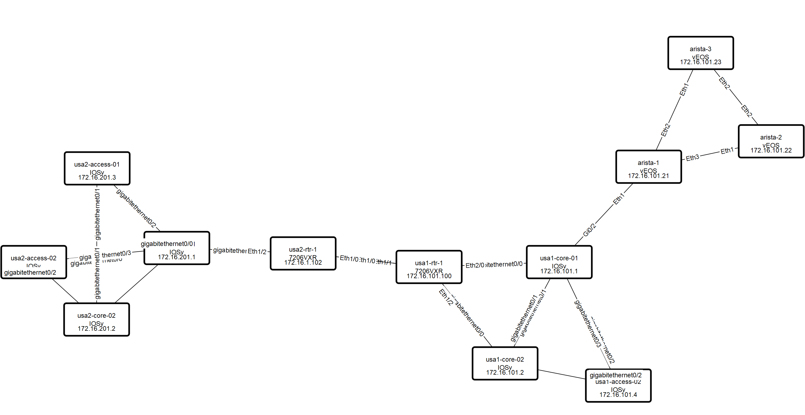
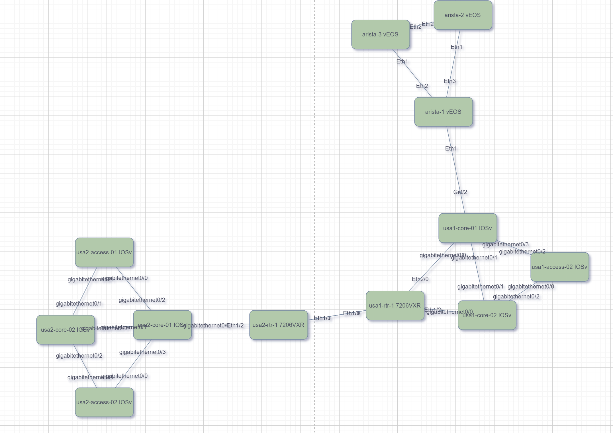

# Secure Cartography

A secure, Python-based network discovery and mapping tool that generates comprehensive network topology maps using SSH-based device interrogation.


## Overview

Secure Cartography provides automated network discovery, visualization, and topology merging capabilities while maintaining strict security standards. It supports various network devices including Cisco IOS, NX-OS, and Arista EOS platforms.


## Installation

### From GitHub
```bash
# Clone the repository
git clone https://github.com/scottpeterman/secure_cartography.git
cd secure_cartography

# Create and activate virtual environment
python -m venv .venv
source .venv/bin/activate  # On Windows: .venv\Scripts\activate

# Install dependencies
pip install -r requirements.txt
```

PyPI package coming soon!

## Usage

The project includes two main executable scripts:

1. **Network Discovery and Mapping**
   ```bash
   python -m secure_cartography.scart
   ```

2. **Topology Merge Tool**
   ```bash
   python -m secure_cartography.merge_dialog
   ```


## Key Features

### Security
- Master password-based encryption system for credentials
- Machine-specific keyring integration
- PBKDF2-based key derivation
- Encrypted credential storage with Fernet encryption
- No plaintext passwords stored anywhere in the application
- Secure session handling

### Network Discovery
- Multi-threaded SSH-based device discovery
- Support for multiple authentication methods
- Configurable discovery depth and timeout settings
- Exclusion pattern support
- Real-time discovery progress monitoring
- Device platform auto-detection
- Comprehensive logging system

### Topology Management
- JSON-based topology storage
- Connection de-duplication
- Interface normalization across platforms
- Support for CDP and LLDP
- Automatic handling of bi-directional neighbor relationships
- Debug information capture (optional)

### Visualization
- Dark mode optimized network diagrams
- Multiple layout algorithms:
  - Balloon layout for hierarchical networks
  - KK (Kamada-Kawai) for general topologies
  - Circular layout option
  - Multipartite layout support
- Intelligent node positioning
- Edge label support for interface information
- SVG output for high-quality graphics
- Real-time preview capabilities

### Map Merging
- Intelligent topology merging
- Preview before merge
- Maintains connection integrity
- Connection de-duplication during merge
- Comprehensive merge logging
- Multiple file support

## Project Structure
```
secure_cartography/
├── README.md
├── log/                    # Device interrogation logs
├── output/                # Raw discovery output
├── requirements.txt       # Python dependencies
├── screenshots/          # Documentation images
├── secure_cartography/   # Main package
│   ├── __init__.py
│   ├── credslib.py        # Credential management
│   ├── diagrams.py        # Visualization engine
│   ├── driver_discovery.py # Platform detection
│   ├── enh_int_normalizer.py # Interface normalization
│   ├── interface_normalizer.py
│   ├── merge_dialog.py    # Map merge tool
│   ├── network_discovery.py # Core discovery
│   ├── scart.py          # Main application
│   ├── ssh_client_pysshpass.py # SSH handling
│   └── tfsm_fire.py      # TextFSM template handling
└── tfsm_templates.db     # TextFSM parsing templates
```

## Technology Stack

### Core Technologies
- Python 3.9+
- PyQt6 for GUI
- NetworkX for graph processing
- Matplotlib for visualization
- Cryptography.io for security

### Security Components
- PBKDF2 key derivation
- Fernet encryption
- System keyring integration
- Platform-specific secure storage

### Network Interaction
- Paramiko/SSH2 for device communication
- TextFSM for output parsing
- Custom platform detection
- Enhanced interface normalization

### Data Storage
- JSON for topology data
- YAML for configuration
- SVG for visualizations
- Encrypted credential storage

## Security Architecture

### Credential Protection
1. **Master Password System**
   - PBKDF2-derived key generation
   - Machine-specific salt
   - Secure system keyring integration

2. **Storage Security**
   - Fernet encryption for credentials
   - No plaintext password storage
   - Platform-specific secure storage locations

3. **Runtime Security**
   - Memory-safe credential handling
   - Secure credential cleanup
   - Protected GUI input fields

## Requirements

See `requirements.txt` for complete list of Python dependencies.

Core requirements:
- Python 3.9+
- PyQt6
- NetworkX
- Matplotlib
- Cryptography
- PyYAML
- Paramiko

## License

This project is licensed under the GNU General Public License v3.0 (GPLv3).

## Contributing

Contributions are welcome! Please feel free to submit a Pull Request.

## Acknowledgments

[Insert Acknowledgments]

# Appendix A: Diagram Export and Visualization Tools

Secure Cartography exports network maps in multiple formats to support different visualization and analysis needs.

## Exported Formats

### yEd GraphML (.graphml)



yEd is a powerful graph editor that excels at visualizing and analyzing complex networks. The GraphML export from Secure Cartography is specifically formatted to take advantage of yEd's advanced features:

- Multiple automatic layout algorithms
- Advanced grouping capabilities
- The "Neighborhood" feature in the licensed version is particularly valuable for analyzing large networks, as it can intelligently extract and visualize network segments
- Extensive node/edge formatting options
- High-quality vector export

[yEd Graph Editor](https://www.yworks.com/products/yed) is available as both a free version and a licensed version with additional features.

### draw.io (.drawio)


draw.io (also known as diagrams.net) provides a user-friendly interface for diagram editing and is particularly well-suited for:

- Collaborative diagram editing
- Web-based access
- Integration with various platforms
- Custom stencils and shapes
- Multiple export formats

[draw.io](https://www.diagrams.net/) is free and open source, with desktop and web-based versions available.

## Usage Notes

1. Both tools offer far more layout and visualization options than shown in the default exports. Users are encouraged to experiment with different layouts to find what works best for their network topology.

2. For large networks:
   - yEd's hierarchical layouts often provide the clearest visualization
   - The "Neighborhood" feature in yEd Pro is invaluable for focusing on specific network segments
   - draw.io's organic layouts can help visualize natural clustering in the network

3. Editing Tips:
   - Both tools maintain interface labels and node properties from Secure Cartography
   - Node positions and groupings can be manually adjusted
   - Additional network documentation can be added directly in the tools
   - Both support various export formats for documentation needs

## Recommendations

- Use yEd for:
  - Detailed network analysis
  - Large network visualization
  - Professional documentation
  - Segment-focused analysis "Neighborhoods"

- Use draw.io for:
  - Quick edits and sharing
  - Web-based collaboration
  - Platform-independent access
  - Integration with other documentation tools

# Appendix B: TFSM_Fire - Intelligent Template Matching

## Overview

TFSM_Fire represents a novel approach to TextFSM template matching that uses an intelligent scoring system and thread-safe database operations to automatically select the best parsing template for network device output.

## Key Features

### 1. Intelligent Template Selection
```python
def find_best_template(self, device_output: str, filter_string: Optional[str] = None) -> Tuple[
    Optional[str], Optional[List[Dict]], float]:
```
- Automatically evaluates multiple templates against device output
- Returns the best matching template, parsed output, and confidence score
- Uses sophisticated scoring algorithm to determine template fitness
- Supports optional filtering to narrow template search space

### 2. Thread-Safe Design
```python
class ThreadSafeConnection:
    """Thread-local storage for SQLite connections"""
    def __init__(self, db_path: str, verbose: bool = False):
        self.db_path = db_path
        self.verbose = verbose
        self._local = threading.local()
```
- Implements thread-local storage for database connections
- Ensures safe concurrent access to template database
- Manages connection lifecycle automatically
- Supports high-performance parallel template matching

### 3. Scoring Algorithm
The template scoring system evaluates matches based on multiple factors:
- Number of successfully parsed records
- Special handling for version command output
- Intelligent weighting based on command type
- Score normalization for consistent evaluation

### 4. Template Filtering
```python
def get_filtered_templates(self, connection: sqlite3.Connection, filter_string: Optional[str] = None):
    """Get filtered templates from database using provided connection."""
    if filter_string:
        filter_terms = filter_string.replace('-', '_').split('_')
        query = "SELECT * FROM templates WHERE 1=1"
        params = []
        for term in filter_terms:
            if term and len(term) > 2:
                query += " AND cli_command LIKE ?"
                params.append(f"%{term}%")
```
- Smart filtering of template database
- Handles hyphenated command names
- Minimum term length requirements
- SQL injection prevention

## Use Cases

1. **Automated Template Selection**
   - Network automation scripts
   - Multi-vendor environments
   - Unknown command output parsing

2. **Parallel Processing**
   - Bulk device configuration analysis
   - Large-scale network discovery
   - Real-time network monitoring

3. **Template Development**
   - Template testing and validation
   - Command output verification
   - Parser development and debugging

## Technical Implementation

### Connection Management
```python
@contextmanager
def get_connection(self):
    """Get a thread-local connection"""
    if not hasattr(self._local, 'connection'):
        self._local.connection = sqlite3.connect(self.db_path)
        self._local.connection.row_factory = sqlite3.Row
```
- Context manager for automatic resource cleanup
- Thread-local storage prevents connection conflicts
- SQLite connection pooling for efficiency

### Template Parsing
```python
textfsm_template = textfsm.TextFSM(io.StringIO(template['textfsm_content']))
parsed = textfsm_template.ParseText(device_output)
parsed_dicts = [dict(zip(textfsm_template.header, row)) for row in parsed]
```
- In-memory template processing
- Structured data extraction
- Dictionary-based output formatting

## Advantages Over Traditional Approaches

1. **Dynamic Template Selection**
   - Traditional approach requires exact template match
   - TFSM_Fire finds best match automatically
   - Handles variations in command output

2. **Concurrent Processing**
   - Traditional parsers are often single-threaded
   - TFSM_Fire supports parallel operations
   - Thread-safe database access

3. **Maintainability**
   - Centralized template database
   - Easy template updates and additions
   - Performance monitoring capabilities

## Integration Example

```python
engine = TextFSMAutoEngine("./templates.db", verbose=True)

# Process device output
best_template, parsed_data, confidence = engine.find_best_template(
    device_output="show version output here",
    filter_string="show_version"
)

if confidence > 30.0:  # Confidence threshold
    # Use parsed data
    print(f"Found matching template: {best_template}")
    print(f"Parsed data: {parsed_data}")
else:
    print("No suitable template found")
```

## Future Enhancements

1. **Machine Learning Integration**
   - Template scoring based on historical success
   - Pattern recognition for new command types
   - Automated template generation

2. **Performance Optimization**
   - Template caching
   - Precompiled template patterns
   - Advanced database indexing

3. **Template Management**
   - Version control integration
   - Automated testing framework
   - Template validation tools